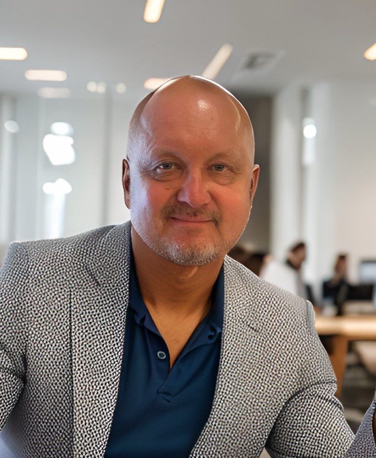

**Blog by Dmitri K Klein**

*Observation is the key to understanding!*

**My R&D and corporate production experience with Grafana**

🧭 Also explore topics like:
- 📊 Grafana, Prometheus, and Loki
- 🔍 Distributed tracing with OpenTelemetry
- ☁️ AWS infrastructure and Kubernetes
- 🧠 Time-series databases like InfluxDB and VictoriaMetrics

